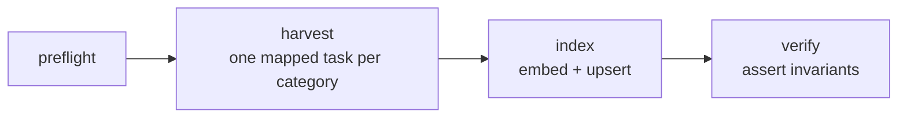

# Scintilla

Hybrid search and grounded question answering over scientific preprints, with a
retrieval evaluation harness that runs in CI.

Most retrieval systems are shipped without ever being measured. This one exists
to measure itself: keyword search, vector search, and the fusion of the two are
compared against a hand-built golden set, and a regression gate fails the build
if retrieval quality drops.

---

## Status

Built in the open over 14 days. Honest markers - nothing is ticked before it
works.

| Phase | Scope | State |
|---|---|---|
| 1 · Foundation | Django, PostgreSQL, containers, CI | ✅ Complete |
| 2 · Ingestion | arXiv harvesting, embeddings, indexing, Airflow | ✅ Complete |
| 3 · Retrieval & evaluation | BM25, dense, RRF, golden set, metrics, CI gate | 🟡 Retrieval done, evaluation next |
| 4 · Ship | React frontend, MCP server, deployment, hardening | ⬜ Not started |

Phase 1 means the foundation is verified, not that the system does anything
useful yet: a clean clone installs, migrates against PostgreSQL 16, serves a
read-only API and passes 29 tests, and CI checks lint, tests, dependencies and
the container build on every push.

Phase 2 harvests arXiv into PostgreSQL, chunks against the embedding model's
own tokenizer, embeds into pgvector and indexes into OpenSearch, on a daily
Airflow schedule. The corpus is 3,377 papers across `hep-ex`, `hep-th`,
`hep-ph`, `cs.IR` and `astro-ph.HE`. The phase gate was that the DAG could be triggered twice
and the second run index nothing; it does exactly that, which is the property
that makes a scheduled pipeline safe to leave running.



`preflight` fails fast on a bad environment. `harvest` is mapped per category
so one category rate-limiting cannot fail the others. `index` touches only what
changed. `verify` asserts that no chunk is unembedded, that the index document
count equals the chunk count and that every paper is marked indexed — and fails
the run if any of those is false.

**Nothing is measured yet.** Phase 3 has built the three retrievers and the
fusion that combines them — `POST /api/search/` accepts `mode` as `bm25`,
`dense` or `hybrid` — but there is no golden set and no metrics, so **no claim
is made about retrieval quality**. The `mode` parameter exists so that the
ablation, when it arrives, measures this endpoint rather than a script beside
it.

What can be said is that the two retrievers disagree, which is the premise
fusion depends on. Over the live corpus their top-3 results overlapped by 1/3 on
keyword and paraphrase queries and by **0/3** on a conceptual one. In two of
four cases the fused top result had been ranked first by neither retriever. Those
are impressions recorded as hypotheses, not results.

**No evaluation numbers are published yet.** When they exist they will appear
here, including the cases where hybrid retrieval performs *worse* than its
components.

---

## The idea

Keyword search and vector search fail differently.

**BM25** matches words. Ask it for a detector name or a dataset identifier and it
is close to unbeatable. Ask it for a concept phrased in words the author did not
use and it returns nothing useful.

**Dense retrieval** matches meaning. It handles paraphrase and conceptual queries
well, and it will confidently miss an exact identifier because the embedding does
not preserve rare tokens.

Combining them with Reciprocal Rank Fusion is standard practice. What is not
standard is checking whether the combination actually helped - and on which kinds
of query it hurt. That check is the point of this project.

---

## Architecture

```
arXiv API
    │
    ▼
Airflow DAG ──► parse ──► chunk ──► embed (BGE-small)
    │                                    │
    │                    ┌───────────────┴───────────────┐
    │                    ▼                               ▼
    │            OpenSearch (BM25)          PostgreSQL + pgvector (kNN)
    │             lexical index              metadata, run ledger,
    │                    │                   eval results, vectors
    ▼                    │                               │
  ledger                 └───────────────┬───────────────┘
                                         ▼
                              Reciprocal Rank Fusion
                                         │
                                         ▼
                              grounded answer + citations
                                         │
                               ┌─────────┴─────────┐
                               ▼                   ▼
                         REST API (DRF)       MCP server
                               │                   │
                               ▼                   ▼
                        React frontend      LLM tool-calling host
```

The two indexes are split on purpose. OpenSearch publishes no macOS build and
its k-NN plugin has native libraries only for Linux and Windows, so vector
search could not run there on the development machine. Putting the vectors in
Postgres turned out to be the better design anyway: a chunk and its embedding
are written in one transaction, the deployment target runs one JVM instead of a
larger one, and Reciprocal Rank Fusion combines *ranked lists*, so it does not
care that the two runs came from different systems. The trade-off given up is
real and worth stating: OpenSearch can filter a k-NN query by category *inside*
the vector search, whereas here a filtered dense query is a SQL `WHERE` applied
after the HNSW scan. `ingestion/vectors.py` records this in full.

Full diagrams, including the retrieval and fusion path, are in
[docs/ARCHITECTURE.md](docs/ARCHITECTURE.md).

---

## Stack

| Layer | Choice | Why |
|---|---|---|
| API | Django 5 + Django REST Framework | Migrations, admin and auth without assembling them by hand |
| Metadata | PostgreSQL 16 | Relational integrity for the run ledger and evaluation history |
| Lexical index | OpenSearch 2 | BM25, Apache-2.0, the reference implementation of the algorithm |
| Vector index | pgvector (HNSW, cosine) | Vectors live beside the rows they describe, written in one transaction |
| Embeddings | BAAI/bge-small-en-v1.5 | 384-dim, runs on CPU, small enough for a free-tier VM |
| Orchestration | Apache Airflow | Retries, backfill and run history that cron cannot express |
| Generation | Llama 3.3 70B via Groq | Free tier; the system degrades to search-only without it |
| Frontend | React 18 + TypeScript + Vite | Strict-mode types generated from the OpenAPI schema |
| Protocol | Model Context Protocol | Exposes retrieval as callable tools |

Every component is free to run: PostgreSQL, OpenSearch and Airflow are all
self-hosted and open source, the embedding model runs on CPU, and Groq's free
tier covers generation. The system degrades to search-only if the LLM is
unavailable rather than failing.

---

## Running it

Two supported paths.

**With Docker** - one command, everything included:

```bash
cp .env.example .env
docker compose up --build
```

**Without Docker** - services installed natively via Homebrew, for machines
where Docker is not available:

See [docs/LOCAL_SETUP.md](docs/LOCAL_SETUP.md).

Either way the API is then at `http://localhost:8000/api/` and the schema at
`http://localhost:8000/api/docs/`.

### Searching

```bash
curl -s http://localhost:8000/api/search/ \
  -H 'Content-Type: application/json' \
  -d '{"query": "why is dark matter hard to detect directly", "mode": "hybrid", "top_k": 5}'
```

`mode` is `bm25`, `dense` or `hybrid` (the default). Each result carries a
`debug` object showing which retrievers found the paper, at what rank, and what
each contributed to the fused score — which is the first thing to read when a
ranking looks wrong.

To compare all three modes on the same queries:

```bash
python scripts/compare_modes.py
```

---

## Documentation

| Document | What is in it |
|---|---|
| [docs/ARCHITECTURE.md](docs/ARCHITECTURE.md) | High-level and low-level design, the split-index decision, data model, ingestion and orchestration flows |
| [docs/LOCAL_SETUP.md](docs/LOCAL_SETUP.md) | Running every service natively, without Docker |
| [docs/DOCKER_SETUP.md](docs/DOCKER_SETUP.md) | Running the stack with Docker Compose |
| [docs/SECURITY.md](docs/SECURITY.md) | Threat model, what is enforced, and what is deliberately deferred |

---

## Tests

```bash
pytest                      # unit tests, no external services needed
pytest -m integration       # requires Postgres and OpenSearch running
ruff check .                # lint
```

Without `DATABASE_URL` the suite falls back to in-memory SQLite so it runs
anywhere. To exercise the engine production uses:

```bash
DATABASE_URL=postgres://$(whoami)@localhost:5432/scintilla pytest -q
```

CI runs the unit suite, the linter, a dependency audit and a container build on
every push. CI always uses a real PostgreSQL 16 service container, so a green
CI run is stronger evidence than a green local run.

---

## Licence

MIT - see [LICENSE](LICENSE).
