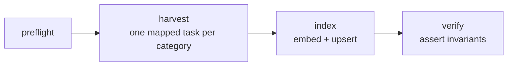

# Scintilla

Hybrid search and grounded question answering over scientific preprints, with a
retrieval evaluation harness that runs in CI.

Most retrieval systems are shipped without ever being measured. This one exists
to measure itself: keyword search, vector search, and the fusion of the two are
compared against a hand-built golden set, and a regression gate fails the build
if retrieval quality drops.

---

## Status

Built in the open over 14 days. Honest markers - nothing is ticked before it
works.

| Phase | Scope | State |
|---|---|---|
| 1 · Foundation | Django, PostgreSQL, containers, CI | ✅ Complete |
| 2 · Ingestion | arXiv harvesting, embeddings, indexing, Airflow | ✅ Complete |
| 3 · Retrieval & evaluation | BM25, dense, RRF, golden set, metrics, CI gate | 🟡 Ablation published, CI gate next |
| 4 · Ship | React frontend, MCP server, deployment, hardening | ⬜ Not started |

Phase 1 means the foundation is verified, not that the system does anything
useful yet: a clean clone installs, migrates against PostgreSQL 16, serves a
read-only API and passes 29 tests, and CI checks lint, tests, dependencies and
the container build on every push.

Phase 2 harvests arXiv into PostgreSQL, chunks against the embedding model's
own tokenizer, embeds into pgvector and indexes into OpenSearch, on a daily
Airflow schedule. The corpus is 3,377 papers across `hep-ex`, `hep-th`,
`hep-ph`, `cs.IR` and `astro-ph.HE`. The phase gate was that the DAG could be triggered twice
and the second run index nothing; it does exactly that, which is the property
that makes a scheduled pipeline safe to leave running.



`preflight` fails fast on a bad environment. `harvest` is mapped per category
so one category rate-limiting cannot fail the others. `index` touches only what
changed. `verify` asserts that no chunk is unembedded, that the index document
count equals the chunk count and that every paper is marked indexed — and fails
the run if any of those is false.

**Phase 3 has numbers, and they do not say what I expected.** A hand-labelled
golden set of 50 queries in five classes (163 labelled papers, every one
verified against the live corpus) was swept by all three modes through the same
`get_retriever()` call the API uses. The result is below. The short version is
that **hybrid retrieval did not beat plain dense retrieval on this corpus**, and
the honest reading of the confidence interval is that the two are not
distinguishable at all.

### The ablation

40 answerable queries scored. The 10 unanswerable queries are held out of every
average, because recall over an empty relevant set is 0/0 — scoring them as 0
would penalise every mode equally for a query that has no answer, and scoring
them as 1 would hand every mode a free fifth of a point.

| mode | recall@1 | recall@5 | recall@10 | MRR | nDCG@10 | median ms |
|---|---:|---:|---:|---:|---:|---:|
| bm25 | 0.100 | 0.374 | 0.527 | 0.565 | 0.473 | 5 |
| dense | 0.166 | 0.563 | **0.744** | 0.775 | **0.691** | 24 |
| hybrid | 0.158 | 0.533 | 0.682 | **0.776** | 0.649 | 33 |

Forty queries is not many, so every gap gets a paired bootstrap (10,000
resamples, fixed seed, queries resampled as pairs) rather than being asserted:

| comparison (nDCG@10) | difference | 95% CI | p | W/L/T | significant |
|---|---:|---:|---:|---:|---:|
| dense − bm25 | +0.218 | [+0.128, +0.308] | 0.0001 | 29/7/4 | yes |
| hybrid − bm25 | +0.176 | [+0.122, +0.234] | 0.0001 | 30/4/6 | yes |
| hybrid − dense | −0.041 | [−0.103, +0.020] | 0.194 | 15/20/5 | **no** |

Both semantic modes beat lexical search decisively. Hybrid versus dense is a
coin flip that leans slightly the wrong way: hybrid lost 20 of 40 queries and
won 15, and the interval comfortably contains zero. **The correct statement is
"no detectable difference", not "hybrid is slightly behind" and certainly not
"hybrid wins on MRR"** — that MRR gap is 0.001.

### Why hybrid lost

The per-class split shows it immediately.

| class | bm25 | dense | hybrid |
|---|---:|---:|---:|
| exact_term | 0.855 | 0.905 | **0.933** |
| paraphrase | 0.206 | **0.615** | 0.397 |
| conceptual | 0.409 | **0.660** | 0.620 |
| multi_hop | 0.637 | **0.796** | 0.779 |

*(recall@10)*

Hybrid wins exactly where both retrievers are already competent, and loses
badly on paraphrase — the class it was supposed to rescue. BM25 scores 0.206
there. Reciprocal Rank Fusion weights every list equally by construction: it
throws scores away precisely so that incomparable score distributions cannot be
mixed, and the cost of that is it has no way to know one of its inputs is
close to useless on this query. Fusing a strong signal with a bad one at equal
weight produces something in between, which on paraphrase means dropping from
0.615 to 0.397.

Sweeping RRF's `k` — the constant that decides whether the fused order is driven
by one list's conviction (`k→0`) or by agreement between lists (`k` large) —
confirms the mechanism:

| RRF k | recall@10 | paraphrase recall@10 | nDCG@10 |
|---:|---:|---:|---:|
| 5 | **0.748** | 0.579 | 0.676 |
| 10 | 0.733 | 0.537 | 0.672 |
| 20 | 0.707 | 0.484 | 0.660 |
| 60 *(shipped)* | 0.682 | 0.397 | 0.649 |
| 120 | 0.679 | 0.397 | 0.643 |

Performance falls monotonically as `k` rises, which is what "over-rewarding
agreement with a weak retriever" looks like when you plot it. The published
default of 60 — adopted from Cormack et al. (SIGIR 2009) — is close to the worst
setting for this corpus.

**`k` was not retuned to 5 on the strength of that table.** Choosing a
hyperparameter by its score on the same 40 queries you then report, with no
held-out split, is precisely the overfitting this project exists to complain
about. The sweep is published as a diagnosis of *why* hybrid lost, not as a
tuned result. `k` stays at 60.

### What this means

Hybrid search costs an entire OpenSearch dependency, roughly 40% more latency
than dense alone, and buys **no measurable improvement** on this corpus. On the
evidence, dense-only would be the better engineering decision here.

Three caveats that keep this from being a general claim. The corpus is 3,377
arXiv abstracts — short, dense, technical text that embeds unusually well, and
BM25's weakness on paraphrase is partly a consequence of having only an abstract
to match against rather than a full document. The labels were pooled from these
same two retrievers, so both are flattered relative to a system that was never
consulted. And 40 queries is a small sample; the interval says so.

The full per-query record, including everything each mode retrieved and every
label it missed, is in
[`evaluation/results/ablation.json`](evaluation/results/ablation.json), and the
generated summary in
[`evaluation/results/ablation.md`](evaluation/results/ablation.md).
Reproduce with `python manage.py run_eval`.

### The unanswerable queries

Ten queries have no answer in the corpus and sit deliberately close to real
material — a question about diabetic retinopathy screening next to genuine
medical-imaging papers. All three modes returned ten confident results for
every one of them. No retriever abstains, because no retriever can: ranking has
no way to express "none of these". That gap is what the answering layer has to
close.


---

## The idea

Keyword search and vector search fail differently.

**BM25** matches words. Ask it for a detector name or a dataset identifier and it
is close to unbeatable. Ask it for a concept phrased in words the author did not
use and it returns nothing useful.

**Dense retrieval** matches meaning. It handles paraphrase and conceptual queries
well, and it will confidently miss an exact identifier because the embedding does
not preserve rare tokens.

Combining them with Reciprocal Rank Fusion is standard practice. What is not
standard is checking whether the combination actually helped - and on which kinds
of query it hurt. That check is the point of this project.

---

## Architecture

```
arXiv API
    │
    ▼
Airflow DAG ──► parse ──► chunk ──► embed (BGE-small)
    │                                    │
    │                    ┌───────────────┴───────────────┐
    │                    ▼                               ▼
    │            OpenSearch (BM25)          PostgreSQL + pgvector (kNN)
    │             lexical index              metadata, run ledger,
    │                    │                   eval results, vectors
    ▼                    │                               │
  ledger                 └───────────────┬───────────────┘
                                         ▼
                              Reciprocal Rank Fusion
                                         │
                                         ▼
                              grounded answer + citations
                                         │
                               ┌─────────┴─────────┐
                               ▼                   ▼
                         REST API (DRF)       MCP server
                               │                   │
                               ▼                   ▼
                        React frontend      LLM tool-calling host
```

The two indexes are split on purpose. OpenSearch publishes no macOS build and
its k-NN plugin has native libraries only for Linux and Windows, so vector
search could not run there on the development machine. Putting the vectors in
Postgres turned out to be the better design anyway: a chunk and its embedding
are written in one transaction, the deployment target runs one JVM instead of a
larger one, and Reciprocal Rank Fusion combines *ranked lists*, so it does not
care that the two runs came from different systems. The trade-off given up is
real and worth stating: OpenSearch can filter a k-NN query by category *inside*
the vector search, whereas here a filtered dense query is a SQL `WHERE` applied
after the HNSW scan. `ingestion/vectors.py` records this in full.

Full diagrams, including the retrieval and fusion path, are in
[docs/ARCHITECTURE.md](docs/ARCHITECTURE.md).

---

## Stack

| Layer | Choice | Why |
|---|---|---|
| API | Django 5 + Django REST Framework | Migrations, admin and auth without assembling them by hand |
| Metadata | PostgreSQL 16 | Relational integrity for the run ledger and evaluation history |
| Lexical index | OpenSearch 2 | BM25, Apache-2.0, the reference implementation of the algorithm |
| Vector index | pgvector (HNSW, cosine) | Vectors live beside the rows they describe, written in one transaction |
| Embeddings | BAAI/bge-small-en-v1.5 | 384-dim, runs on CPU, small enough for a free-tier VM |
| Orchestration | Apache Airflow | Retries, backfill and run history that cron cannot express |
| Generation | Llama 3.3 70B via Groq | Free tier; the system degrades to search-only without it |
| Frontend | React 18 + TypeScript + Vite | Strict-mode types generated from the OpenAPI schema |
| Protocol | Model Context Protocol | Exposes retrieval as callable tools |

Every component is free to run: PostgreSQL, OpenSearch and Airflow are all
self-hosted and open source, the embedding model runs on CPU, and Groq's free
tier covers generation. The system degrades to search-only if the LLM is
unavailable rather than failing.

---

## Running it

Two supported paths.

**With Docker** - one command, everything included:

```bash
cp .env.example .env
docker compose up --build
```

**Without Docker** - services installed natively via Homebrew, for machines
where Docker is not available:

See [docs/LOCAL_SETUP.md](docs/LOCAL_SETUP.md).

Either way the API is then at `http://localhost:8000/api/` and the schema at
`http://localhost:8000/api/docs/`.

### Searching

```bash
curl -s http://localhost:8000/api/search/ \
  -H 'Content-Type: application/json' \
  -d '{"query": "why is dark matter hard to detect directly", "mode": "hybrid", "top_k": 5}'
```

`mode` is `bm25`, `dense` or `hybrid` (the default). Each result carries a
`debug` object showing which retrievers found the paper, at what rank, and what
each contributed to the fused score — which is the first thing to read when a
ranking looks wrong.

To compare all three modes on the same queries:

```bash
python scripts/compare_modes.py
```

---

## Documentation

| Document | What is in it |
|---|---|
| [docs/ARCHITECTURE.md](docs/ARCHITECTURE.md) | High-level and low-level design, the split-index decision, data model, ingestion and orchestration flows |
| [docs/LOCAL_SETUP.md](docs/LOCAL_SETUP.md) | Running every service natively, without Docker |
| [docs/DOCKER_SETUP.md](docs/DOCKER_SETUP.md) | Running the stack with Docker Compose |
| [docs/SECURITY.md](docs/SECURITY.md) | Threat model, what is enforced, and what is deliberately deferred |

---

## Tests

```bash
pytest                      # unit tests, no external services needed
pytest -m integration       # requires Postgres and OpenSearch running
ruff check .                # lint
```

Without `DATABASE_URL` the suite falls back to in-memory SQLite so it runs
anywhere. To exercise the engine production uses:

```bash
DATABASE_URL=postgres://$(whoami)@localhost:5432/scintilla pytest -q
```

CI runs the unit suite, the linter, a dependency audit and a container build on
every push. CI always uses a real PostgreSQL 16 service container, so a green
CI run is stronger evidence than a green local run.

---

## Licence

MIT - see [LICENSE](LICENSE).
