# Architecture

Scintilla is a hybrid retrieval system over arXiv papers. It harvests papers on
a schedule, indexes them two different ways, and — once Phase 3 lands — fuses
the two rankings and measures whether the fusion actually helped.

This document is written to be read top-down: the high-level picture first,
then one section per subsystem in enough detail to modify it.

> **Status.** Sections marked ⬜ are not built yet. This document describes the
> intended design and marks honestly which parts of it currently exist. See
> [Current state](#current-state).

---

## 1. High level

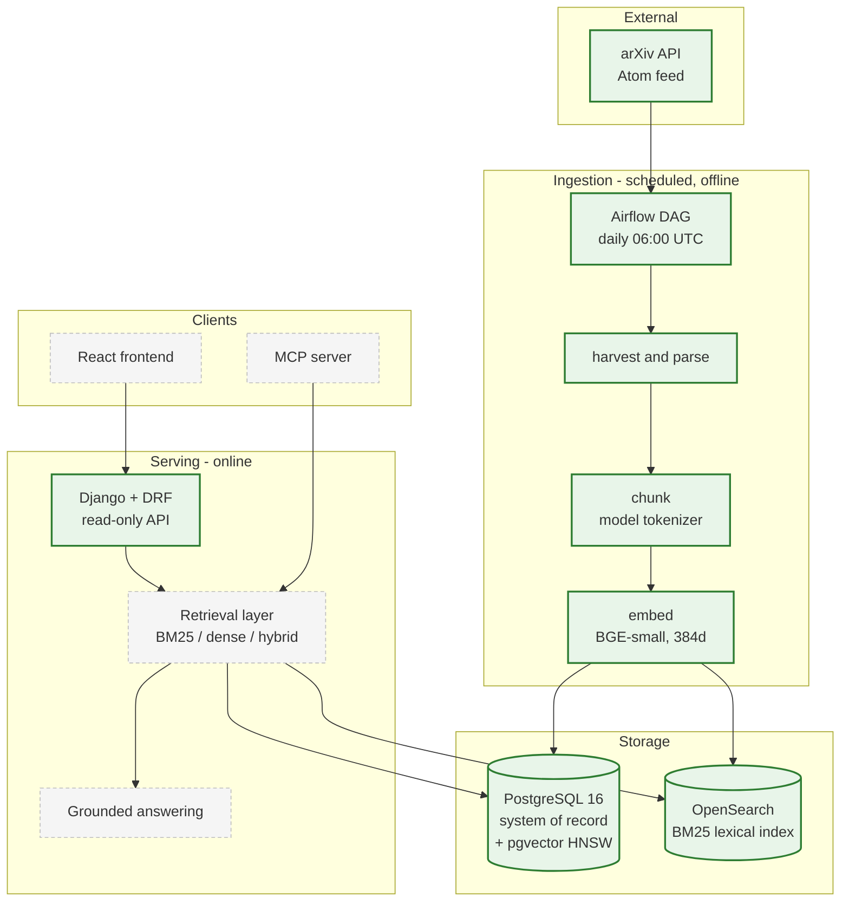

Green is built and running. Dashed grey is not built yet.

### The three ideas that shape everything else

**PostgreSQL is the system of record; the search index is disposable.**
Every chunk, vector and piece of provenance lives in PostgreSQL. OpenSearch
holds a derived copy. That means re-indexing after a chunking or embedding
change is a routine operation, not a data-loss risk — you can drop the index
and rebuild it from Postgres at any time.

**Ingestion is never in the request path.** Airflow writes to the database on a
schedule. The API only reads. A failed harvest degrades index *freshness*, not
availability — the system keeps answering from what it already has.

**Retrieval will sit behind one interface with three implementations.** BM25,
dense and hybrid are interchangeable. That is what makes an honest ablation
possible: the evaluation harness swaps implementations, not code paths.

---

## 2. The split index

This is the least obvious decision in the system, so it gets its own section.

**The lexical index and the vector index live in different databases.**
OpenSearch does BM25. PostgreSQL, via the pgvector extension, does approximate
nearest-neighbour over embeddings using an HNSW index.

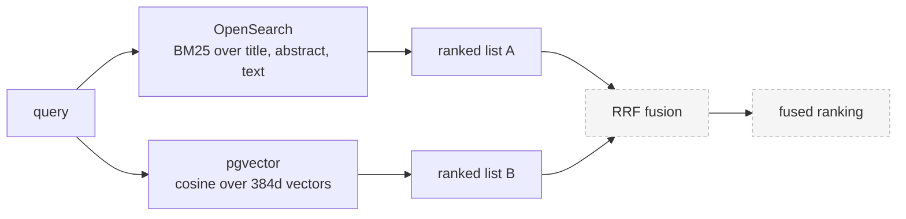

**Why it ended up this way.** The original design put both in OpenSearch using
a `knn_vector` field. That is impossible on this development machine: OpenSearch
publishes no macOS build, so Homebrew compiles the *minimal* distribution from
source, which ships with zero plugins — and `opensearch-knn` is native code with
JNI bindings for Linux and Windows only.

**Why it was kept after the constraint was understood.** Three real benefits:

- A chunk and its vector are written in **one transaction**. The failure mode
  where a process dies between "wrote the row" and "wrote the vector" does not
  exist.
- One fewer JVM to run, which matters on a small free-tier VM.
- Reciprocal Rank Fusion combines *ranked lists*. It never needs the two
  retrievers to share a store, so nothing about hybrid retrieval is
  compromised.

**The honest cost.** OpenSearch can pre-filter a k-NN query by category *inside*
the vector search. Here, a filtered dense query is a SQL `WHERE` wrapped around
an HNSW scan, which can return fewer than `k` results when the filter is
selective. At a few thousand documents this is not measurable. At a few million
it would need revisiting.

---

## 3. Data model

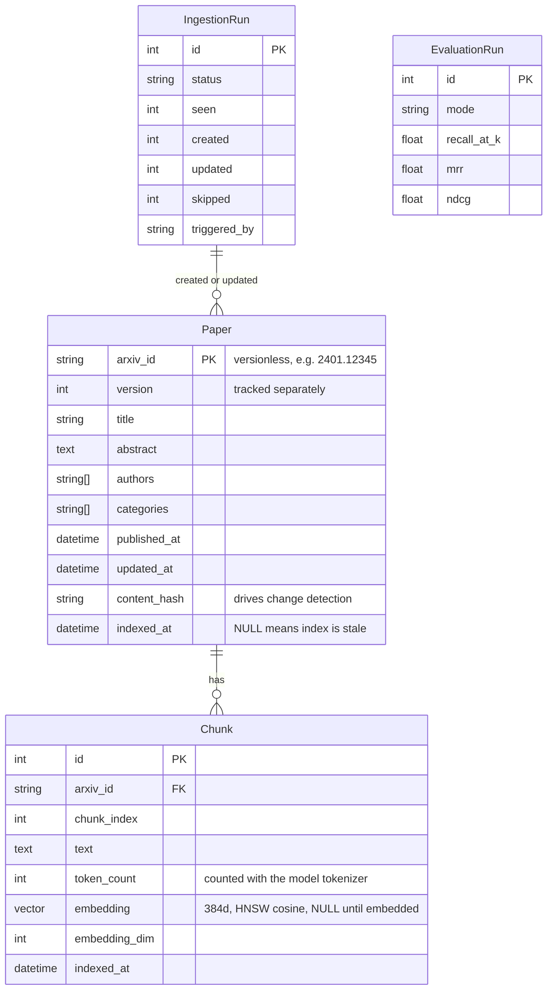

Two schema decisions worth knowing:

**`arxiv_id` is stored without its version suffix**, with `version` as a
separate integer. arXiv identifies a revised paper as `2401.12345v2`. Storing
the versioned form would make every revision a *new row* rather than an update,
silently duplicating the corpus over time.

**`indexed_at` being NULL is meaningful.** It is the schema honestly recording
that PostgreSQL and the search index disagree. Every re-index query is driven by
it, so a crashed indexing run leaves behind an accurate to-do list rather than
an inconsistency nobody notices.

---

## 4. Ingestion

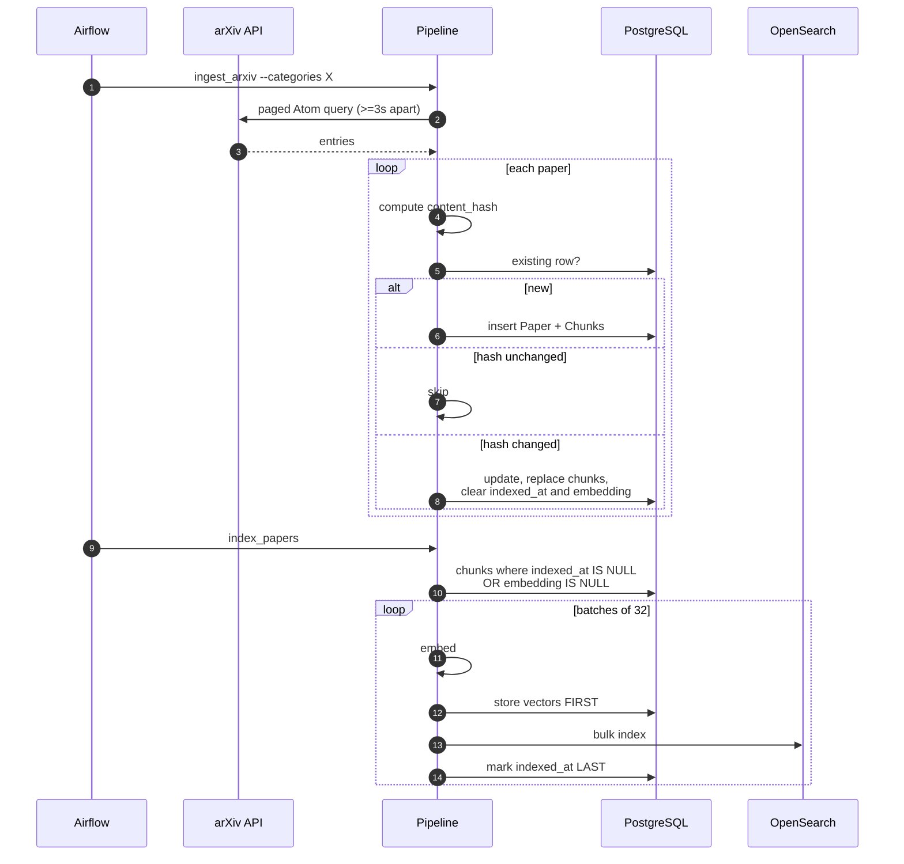

### Idempotency

Three independent mechanisms, because re-running a pipeline must be free:

| Mechanism | What it prevents |
|---|---|
| `arxiv_id` primary key | The same paper becoming two rows |
| `content_hash` comparison | Rewriting rows that did not change |
| Deterministic document IDs — `{arxiv_id}#{chunk_index}` | Re-indexing appending duplicates instead of overwriting |

A fourth mechanism, the **published-date watermark**, is an *optimisation* — it
lets a routine run skip pages it has already walked. It is deliberately not
counted as an idempotency mechanism, because correctness must not depend on it.

### Write ordering, and why it is what it is

Vectors go to PostgreSQL **before** documents go to OpenSearch, and
`indexed_at` is set **last**. So a crash can only ever produce one state:
work that was fully completed, plus work that still looks outstanding. It can
never produce work that looks done but isn't.

This is tested by killing the indexer with `SIGKILL` mid-run: 192 chunks
written, 98 still outstanding, `unembedded == unindexed == 98` exactly. Re-running
picked up precisely those 98 and finished with chunk count equal to document
count and zero duplicates.

### Bulk indexing

OpenSearch's `_bulk` endpoint returns **HTTP 200 even when individual documents
fail**. Code that checks only the status code reports success while silently
indexing a fraction of the corpus. The indexer parses per-item results, retries
failures individually, and refuses to mark anything as indexed if any item
failed.

---

## 5. Orchestration

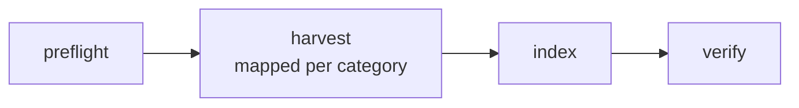

Daily at 06:00 UTC. `catchup=False`, `max_active_runs=1`, two retries with
exponential backoff capped at 30 minutes.

| Task | Responsibility |
|---|---|
| `preflight` | Fails fast on a missing virtualenv, `manage.py`, `DATABASE_URL` or unreachable OpenSearch — a misconfiguration surfaces in seconds, not after a twenty-minute harvest |
| `harvest` | One dynamically mapped task per arXiv category, so a category that starts rate-limiting fails alone |
| `index` | Embeds and indexes only what changed |
| `verify` | Asserts three invariants and **fails the run** if any is false |

**Task boundaries are drawn where it is safe to retry, not where the pipeline
has logical steps.** Splitting fetch / parse / upsert / chunk into separate
tasks reads better in a graph view but is wrong: Airflow moves data between
tasks through XCom, which is rows in a metadata database, not a data bus.

**Tasks shell out to the management commands rather than importing Django.**
That keeps one interface, not two — the scheduled path and the path a human runs
by hand are the same path, so they cannot drift.

**Airflow is heavier than one daily ingest strictly requires.** A cron entry
would run the same two commands. Airflow is here for per-task retries, run
history and failure visibility, and because the operational surface is worth
demonstrating — but the honest statement is that this is a tool chosen slightly
above the requirement, not forced by it.

---

## 6. Retrieval ✅

Three strategies behind one interface:

```python
class Retriever(Protocol):
    name: str

    def retrieve(self, query: str, top_k: int) -> list[RetrievalResult]: ...
```

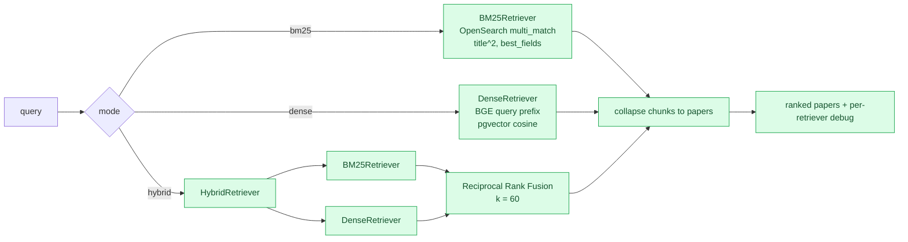

`POST /api/search/` takes `query`, `mode` and `top_k`. The `mode` parameter is
not a user feature — it is the ablation mechanism. The evaluation harness calls
this same endpoint once per mode, which guarantees the published numbers
describe the code path users hit rather than a parallel implementation that can
drift from it.

### Fusion

$$\text{RRF}(d) = \sum_{r \in R} \frac{1}{k + \text{rank}_r(d)}$$

with $k = 60$. RRF combines ranks rather than scores, which matters because a
BM25 score and a cosine similarity are not on a comparable scale, and
normalising them into one is a well-known source of silent bias — min-max
normalisation makes the top score depend on the worst result retrieved, so
adding an irrelevant document at rank 50 changes the score at rank 1.

What $k$ controls is how sharply the top of each list dominates. At $k = 0$,
rank 1 contributes $1.0$ and rank 2 contributes $0.5$. At $k = 60$ they are
$0.0164$ and $0.0161$ — nearly equal, so the fused order is driven by agreement
across retrievers rather than by either one's top hit. A document ranked 3rd by
both scores $2/63 = 0.0317$ and beats a document ranked 1st by one and missed by
the other at $1/61 = 0.0164$.

RRF's real cost is that it cannot distinguish a confident match from a marginal
one, because it discards the scores that would say so. That is the price of not
having to make two distributions comparable.

### Two details that are easy to get wrong

**Both retrievers search to depth 50, not to `top_k`.** Fusion can only reward a
document some retriever returned, so cutting each list to 10 would discard
exactly the disagreements fusion exists to resolve.

**Chunk hits are collapsed to papers before fusion.** Relevance is judged per
paper, and 69 papers in the corpus have more than one chunk. Without collapsing,
such a paper enters fusion once per chunk and accumulates an RRF contribution
for each — rewarding length rather than relevance. Nothing would error; the
ablation would simply measure the wrong thing.

### Observed behaviour

Measured over the live corpus at the end of Phase 3 day 1, top-3 overlap between
BM25 and dense:

| Query type | Overlap | Where hybrid's top hit was ranked |
|---|---|---|
| `Higgs boson coupling measurement` | 1/3 | bm25 1, dense 2 |
| `how do researchers rank documents when answering a search` | 1/3 | bm25 1, dense 2 |
| `why is dark matter hard to detect directly` | **0/3** | bm25 2, dense 8 |
| `neutrino mass and cosmological structure formation` | 1/3 | bm25 4, dense 2 |

The two retrievers disagree substantially on every query tried, and on
conceptual queries they agreed on nothing at all. In two of the four cases
hybrid's top result was ranked first by *neither* retriever — it won on
agreement. That is the behaviour RRF is supposed to produce.

**These were impressions, not measurements.** They were recorded as hypotheses
for the ablation to confirm or refute. It refuted the main one: §7 shows hybrid
does not beat dense on this corpus. Nothing in this section should be read as a
quality claim — §7 is where the claims live.

---

## 7. Evaluation ✅

The part of this project that matters most, and the only reason any number
elsewhere in these docs is allowed to be stated as a fact.

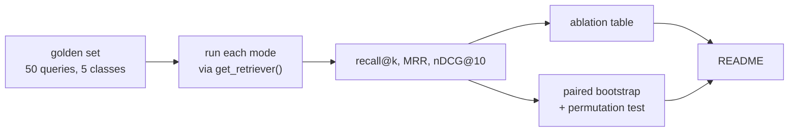

**The harness resolves retrievers through `get_retriever()` — the same call the
API view makes.** This is the design decision the whole layer rests on. The
usual way retrieval evaluation goes wrong is not a faulty metric, it is a
harness that re-implements retrieval and therefore measures the harness. Sharing
the entry point means a measured improvement is an improvement to shipped code.

Metrics are written from scratch in `evaluation/metrics.py` rather than imported
from `pytrec_eval` or `ranx`, and they refuse rather than guess in two cases:
duplicate document IDs in the retrieved list (a paper counted twice inflates
recall) and an empty relevant set (0/0 — scoring it 0 punishes a correct
refusal, scoring it 1 rewards anything). The ten unanswerable queries are held
out of retrieval scoring for exactly that reason and measured separately in §7b.

### The result

40 answerable queries, top-10, macro-averaged:

| mode | recall@10 | MRR | nDCG@10 | median ms |
|---|---:|---:|---:|---:|
| bm25 | 0.527 | 0.565 | 0.473 | 5 |
| dense | **0.744** | 0.775 | **0.691** | 24 |
| hybrid | 0.682 | **0.776** | 0.649 | 33 |

**Hybrid did not win.** A paired bootstrap over 10,000 resamples puts
`hybrid − dense` on nDCG@10 at −0.041 with a 95% interval of [−0.103, +0.020]
and p = 0.194: the two are statistically indistinguishable, and the point
estimate favours the simpler system. Against BM25 both are significant
(p = 0.0001).

The cause is visible per class. RRF discards scores by construction — that is
how it avoids mixing a BM25 score of 14.2 with a cosine similarity of 0.82 — so
it weights both lists equally and cannot know that BM25 is nearly useless on
paraphrase queries (recall@10 0.206 against dense's 0.615). Fusing a strong
ranker with a weak one at equal weight produces something in between: hybrid
scores 0.397 on that class. §6 hypothesised hybrid would win; the measurement
says otherwise, and the hypothesis is wrong.

A sweep of the RRF `k` constant shows performance falling monotonically as `k`
rises, with the published default of 60 close to the worst setting for this
corpus. **`k` was deliberately left at 60.** Retuning it to the best observed
value on the same 40 queries that are then reported would be overfitting to the
test set — the precise failure this project exists to argue against.

---

## 7b. Grounded answering ✅

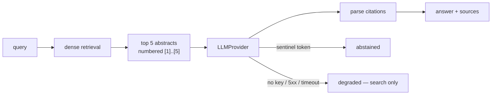

Retrieval answers *did the right documents come back*. That is necessary and not
sufficient: a system can retrieve perfectly and still fabricate, and it can
retrieve badly and still be safe if it refuses.

**Abstention is a sentinel token, not a phrase.** The prompt requires
`INSUFFICIENT_CONTEXT` alone on the first line, and refusal is defined as
emitting it. Grepping free text for "I don't know" is unreliable in both
directions — a model can refuse in unrecognised wording, and can answer fully
while noting some detail is unknown. A decidable rule is the only way to put a
number on it. Checking only the *first* line means an answer that hedges at the
end counts as an answer, so the abstention rate can be understated but never
inflated.

**Degradation is reported, never silent.** No key, a 5xx or a timeout sets
`degraded` on the result rather than returning empty text, because an empty
answer is indistinguishable from a refusal and would drive the abstention rate
to 100% for the wrong reason. Search still returns its results.

Measured over all 50 golden queries, `openai/gpt-oss-120b` at temperature 0:

| measure | count | rate |
|---|---:|---:|
| abstained on unanswerable | 10/10 | **100%** |
| abstained on answerable | 4/40 | 10% |
| citation precision | 24 answers cited | **100%** |
| citation grounding | 40 answerable | 78% |
| answers with no citation | 12 | — |
| hallucinated citation numbers | 0 | — |

Both rates are reported because either alone is gameable: a system that refuses
everything scores 100% on the first and 100% on the second. Two numbers are
worse than they look. A third of answers carried no citation at all, so the
100% precision is measured over the two thirds that complied. And all four
false abstentions had a labelled-relevant paper already in the prompt — one had
four — so they are a prompt-design cost, not a retrieval failure.

**Not measured:** whether a cited passage genuinely *supports* the sentence
attached to it. That needs a human reader or a judge model, and neither was
used, so no claim is made.

**Not yet served.** The answering layer is exercised by the evaluation harness
only; `POST /api/search/` still returns results without prose. Wiring it to the
API is Phase 4 work.

---

## 7c. The CI regression gate ✅

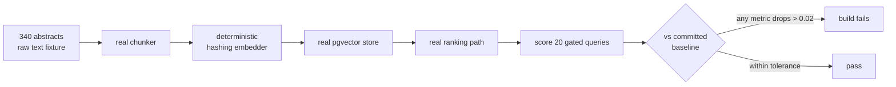

CI has no arXiv corpus and no OpenSearch, so the gate carries its own: 340
abstracts committed as raw text and rebuilt on every run by the real chunker,
the real vector store and the real ranking path. Only the model weights are
substituted, for a deterministic hashing embedder — no download, no network, no
PyTorch.

These scores are **not** a measure of search quality and are not comparable to
§7. The embedder has lexical signal and no semantic signal, and a 340-paper
corpus gives retrieval less to be wrong about. Paraphrase and conceptual queries
are excluded because a bag-of-words embedder scores near zero on them, and a
metric pinned at zero cannot detect a regression. The only question the gate
answers is *did this commit rank worse than the last one, on identical inputs*.

Baseline: recall@5 0.234, recall@10 0.314, MRR 0.511, nDCG@10 0.306 over 20
gated queries. Two runs of unchanged code produce **identical** scores, so the
0.02 tolerance is not absorbing noise — there is none — it absorbs deliberate
change, and anything larger has to be signed off by updating the baseline in a
commit that says why. Each metric is checked on its own; a blended score would
let a collapse in recall hide behind a gain in MRR. Provenance — corpus size,
chunk count, golden set version, top-k — is compared before any metric, because
a run against a different corpus is a different experiment, not a regression.

**Proven by injection.** Dropping the title from the embedded text moves
recall@10 from 0.314 to 0.167 and the gate names the fourteen queries that got
worse. Worth recording honestly: the existing unit tests caught that fault, and
three other injected faults, *before* the gate did. The gate is a second net
measuring a different property — ranking quality rather than component
behaviour — not a replacement for tests.

---

## 7d. The interface ✅

React 18 + TypeScript + Tailwind 4, built with Vite. A single page, four
hundred lines of application code, no router and no state library — the
application has one screen and one request in flight, and anything heavier
would be scaffolding around a problem that does not exist.

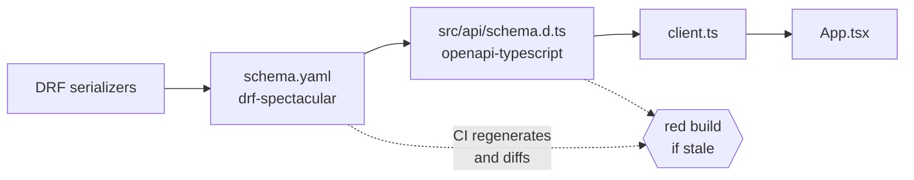

### The contract is generated, not written

`schema.yaml` is produced by `drf-spectacular` from the serializers and
committed. `src/api/schema.d.ts` is produced from that by `openapi-typescript`
and committed. Neither is ever hand-edited, and CI regenerates both and fails on
any difference.

The point is where a mistake surfaces. Hand-written frontend types are a *copy*
of the backend's shape, and a copy drifts silently — the failure appears as an
`undefined` in a user's browser, far from the serializer edit that caused it.
Generating them makes that same edit fail `tsc --noEmit` in CI instead. This was
proved rather than assumed: adding one field to `SearchResponseSerializer` turns
both checks red, naming the field.

The `debug` field is the honest exception. It is a `DictField`, so the schema
types it `Record<string, unknown>` — which is *true*. There is no contract to
generate. It is therefore narrowed once, at runtime, in `api/explain.ts`, with
guards that **fail closed**: an unrecognised shape renders "no explanation
available" rather than a plausible-looking panel assembled from `undefined`. An
explanation that is quietly wrong is worse than none, because this panel is
precisely what you reach for when a ranking looks odd.

### Three decisions

**The retrieval mode is exposed, with its score.** `mode` is the ablation
mechanism; hiding it would make the published table a claim about a different
system than the one being used. Each option shows its measured nDCG@10, which
prevents the interface from implying the most elaborate strategy is the best
one. The panel next to the toggle states the negative result — hybrid − dense
is −0.041, CI [−0.103, +0.020], p = 0.194 — and explains why `k` was not
retuned to the sweep's optimum.

**Failure is a value, not an exception.** `client.ts` returns a discriminated
union with four failure kinds, so a caller cannot render the success branch
without first proving it is on it. "Forgot to handle the error" is not
expressible. Throwing would let a 429 from the search throttle surface as a
blank page and a console message nobody reads; instead it renders as an amber
panel explaining the 60/minute scoped limit and why search has one.

**One request in flight, older ones aborted.** Switching mode twice quickly
otherwise leaves two dense searches racing, and the slower can land last — so
the results on screen would belong to a mode the toggle no longer shows. In an
application whose entire claim is about ranking, that bug presents as *the
ranking is wrong*, which is the most expensive possible misdiagnosis.

### What it makes visible

Degradation is the one thing the UI refuses to be quiet about. When a retriever
fails, hybrid keeps working by silently becoming dense-only — correct runtime
behaviour, and disastrous to leave invisible, because every number on the page
then describes a different system than the label claims. It renders as an amber
banner saying so, in the envelope and again inside the affected result. This
project has already shipped two defects whose whole character was "it kept
working and stopped telling anyone"; not a third.

The clearest thing the panel shows is a failure of the system it is part of. On
*"how bright was the beam when the collisions were recorded"*, hybrid's tenth
result is a paper on CPT violation in neutrino oscillation — nothing to do with
beam luminosity. The panel gives the reason: **BM25 ranked it first** on surface
words, dense did not return it at all, and fusion demoted it to tenth. That one
card is simultaneously the argument for fusing two retrievers and the reason
BM25 alone scores 0.473.

### Not built here

No answer generation. §7b measures it and it is not served, so the interface
does not show it. No pagination, no filters by category or date, no saved
queries — none of them are needed to demonstrate or to falsify the retrieval
claim, which is what this interface is for.

---

## 8. Deployment ⬜

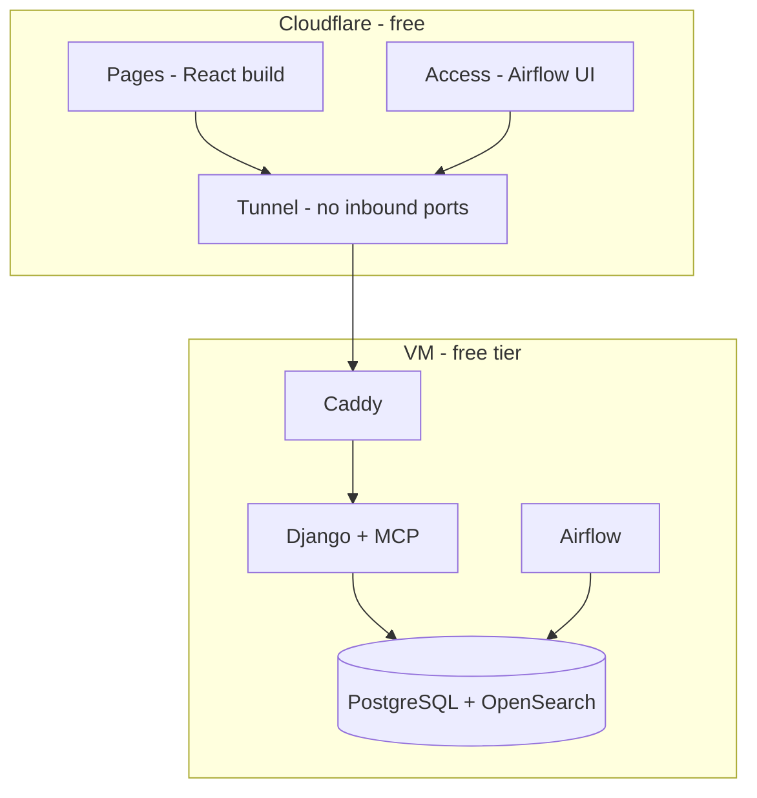

**No container publishes a port to the host.** `cloudflared` dials *outward* and
holds the connection open, so the VM has no inbound firewall rules and no
public listener. The Airflow UI sits behind Cloudflare Access, because it can
trigger DAGs and exposes connection metadata.

---

## Current state

| Subsystem | State |
|---|---|
| Django project, split settings, read-only DRF API | ✅ |
| Schema: Paper, Chunk, IngestionRun, EvaluationRun | ✅ PostgreSQL 16 |
| arXiv client — rate limiting, retry, timeout, `defusedxml` | ✅ |
| Chunking against the embedding model's own tokenizer | ✅ |
| Ingestion pipeline, three idempotency mechanisms | ✅ |
| Embeddings — BGE-small, 384d, L2-normalised | ✅ |
| pgvector HNSW dense index | ✅ |
| OpenSearch BM25 index, versioned behind an alias | ✅ |
| Airflow DAG, daily, verified idempotent | ✅ |
| CI — lint, tests, frontend, regression gate, dependency audit, container build, compose config | ✅ |
| Retrieval interface, three retrievers, RRF fusion | ✅ |
| `POST /api/search/` with mode selection | ✅ |
| Golden set, metrics, ablation, significance testing | ✅ |
| Grounded answering, abstention and citation checking | ✅ measured, not yet served |
| CI regression gate, proven by injected faults | ✅ |
| React frontend, types generated from the OpenAPI schema | ✅ |
| MCP server, deployment, hardening | ⬜ Phase 4 |

Corpus at time of writing: **3,377 papers / 3,465 chunks** across `hep-ex`,
`hep-th`, `hep-ph`, `cs.IR` and `astro-ph.HE`, fully embedded and indexed.

**Retrieval works, and is now measured.** The headline result is that the hybrid
retriever this architecture was built around does not beat plain dense
retrieval on this corpus, and the confidence interval says the two are
indistinguishable. That is published rather than buried, because a system that
can tell you its design assumption was wrong is worth more than one that cannot
tell you anything. The impressions recorded in §6 were hypotheses; §7 promoted
some to results and refuted others.
