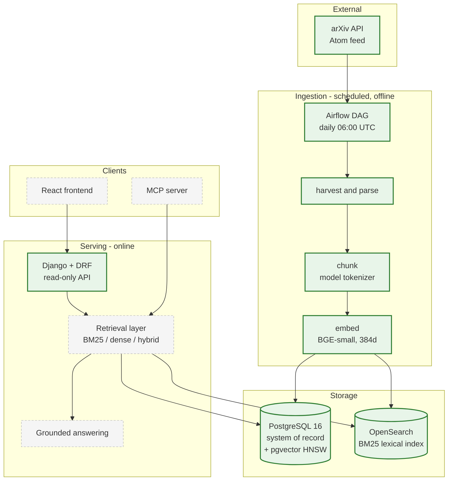
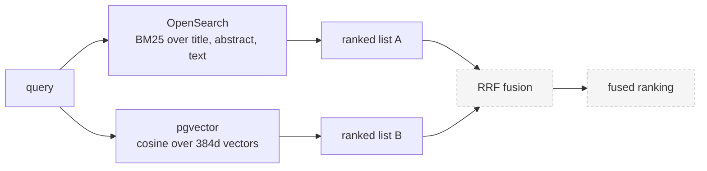
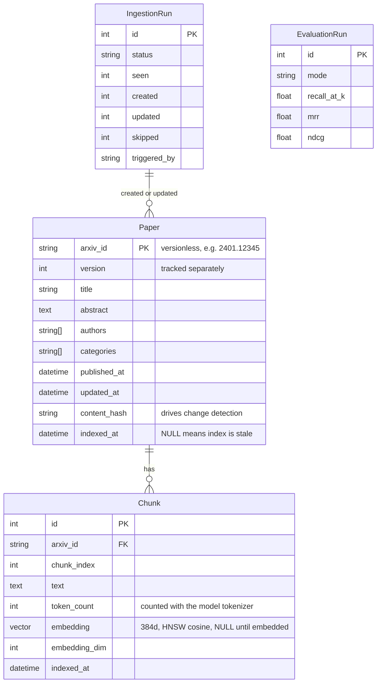
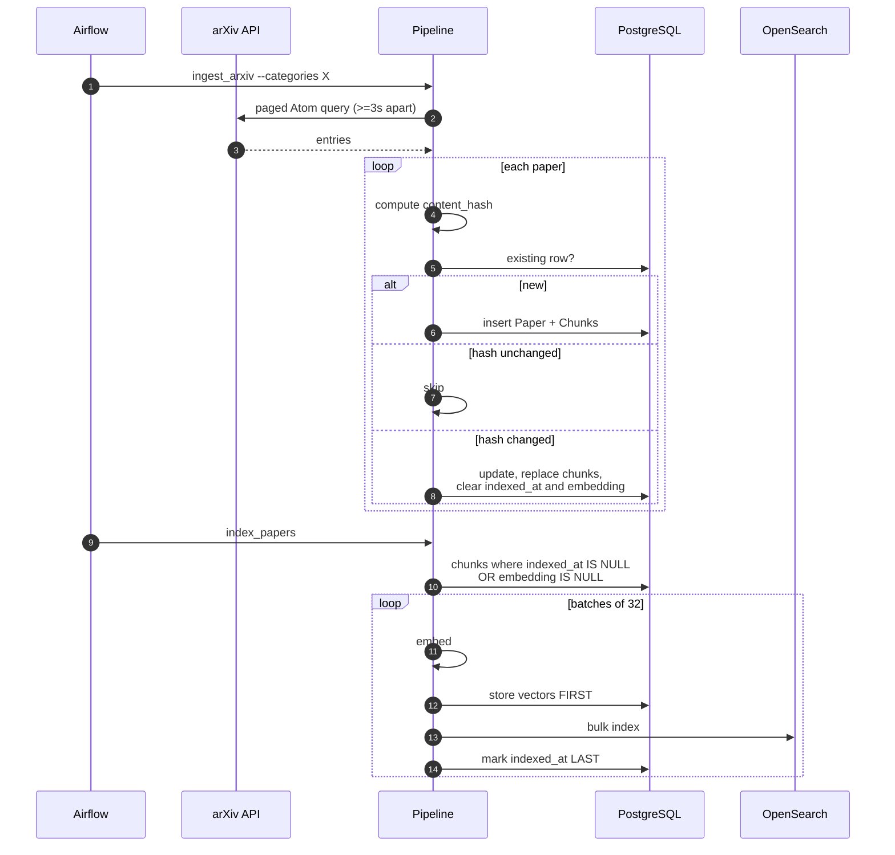
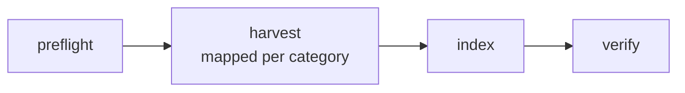
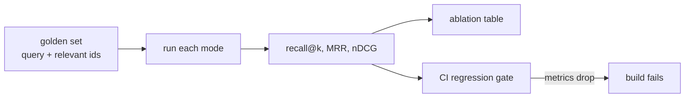
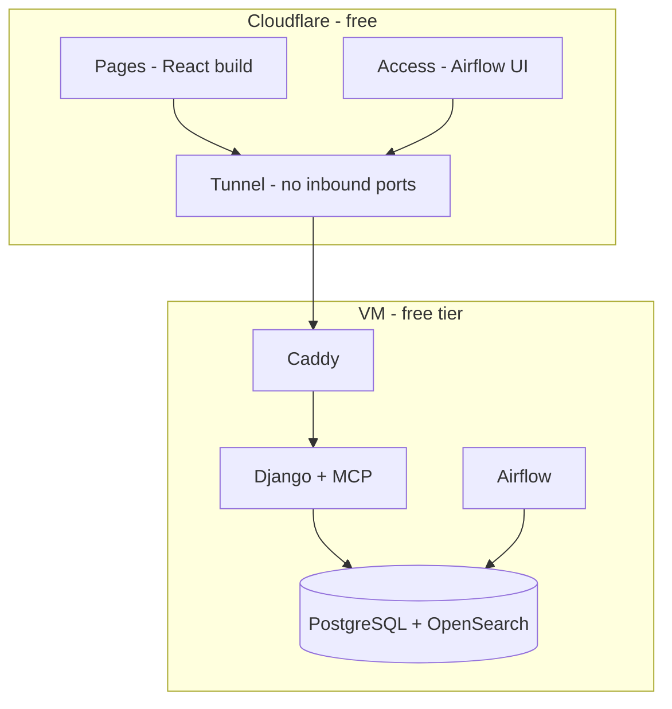

# Architecture

Scintilla is a hybrid retrieval system over arXiv papers. It harvests papers on
a schedule, indexes them two different ways, and — once Phase 3 lands — fuses
the two rankings and measures whether the fusion actually helped.

This document is written to be read top-down: the high-level picture first,
then one section per subsystem in enough detail to modify it.

> **Status.** Sections marked ⬜ are not built yet. This document describes the
> intended design and marks honestly which parts of it currently exist. See
> [Current state](#current-state).

---

## 1. High level



Green is built and running. Dashed grey is not built yet.

### The three ideas that shape everything else

**PostgreSQL is the system of record; the search index is disposable.**
Every chunk, vector and piece of provenance lives in PostgreSQL. OpenSearch
holds a derived copy. That means re-indexing after a chunking or embedding
change is a routine operation, not a data-loss risk — you can drop the index
and rebuild it from Postgres at any time.

**Ingestion is never in the request path.** Airflow writes to the database on a
schedule. The API only reads. A failed harvest degrades index *freshness*, not
availability — the system keeps answering from what it already has.

**Retrieval will sit behind one interface with three implementations.** BM25,
dense and hybrid are interchangeable. That is what makes an honest ablation
possible: the evaluation harness swaps implementations, not code paths.

---

## 2. The split index

This is the least obvious decision in the system, so it gets its own section.

**The lexical index and the vector index live in different databases.**
OpenSearch does BM25. PostgreSQL, via the pgvector extension, does approximate
nearest-neighbour over embeddings using an HNSW index.



**Why it ended up this way.** The original design put both in OpenSearch using
a `knn_vector` field. That is impossible on this development machine: OpenSearch
publishes no macOS build, so Homebrew compiles the *minimal* distribution from
source, which ships with zero plugins — and `opensearch-knn` is native code with
JNI bindings for Linux and Windows only.

**Why it was kept after the constraint was understood.** Three real benefits:

- A chunk and its vector are written in **one transaction**. The failure mode
  where a process dies between "wrote the row" and "wrote the vector" does not
  exist.
- One fewer JVM to run, which matters on a small free-tier VM.
- Reciprocal Rank Fusion combines *ranked lists*. It never needs the two
  retrievers to share a store, so nothing about hybrid retrieval is
  compromised.

**The honest cost.** OpenSearch can pre-filter a k-NN query by category *inside*
the vector search. Here, a filtered dense query is a SQL `WHERE` wrapped around
an HNSW scan, which can return fewer than `k` results when the filter is
selective. At a few thousand documents this is not measurable. At a few million
it would need revisiting.

---

## 3. Data model



Two schema decisions worth knowing:

**`arxiv_id` is stored without its version suffix**, with `version` as a
separate integer. arXiv identifies a revised paper as `2401.12345v2`. Storing
the versioned form would make every revision a *new row* rather than an update,
silently duplicating the corpus over time.

**`indexed_at` being NULL is meaningful.** It is the schema honestly recording
that PostgreSQL and the search index disagree. Every re-index query is driven by
it, so a crashed indexing run leaves behind an accurate to-do list rather than
an inconsistency nobody notices.

---

## 4. Ingestion



### Idempotency

Three independent mechanisms, because re-running a pipeline must be free:

| Mechanism | What it prevents |
|---|---|
| `arxiv_id` primary key | The same paper becoming two rows |
| `content_hash` comparison | Rewriting rows that did not change |
| Deterministic document IDs — `{arxiv_id}#{chunk_index}` | Re-indexing appending duplicates instead of overwriting |

A fourth mechanism, the **published-date watermark**, is an *optimisation* — it
lets a routine run skip pages it has already walked. It is deliberately not
counted as an idempotency mechanism, because correctness must not depend on it.

### Write ordering, and why it is what it is

Vectors go to PostgreSQL **before** documents go to OpenSearch, and
`indexed_at` is set **last**. So a crash can only ever produce one state:
work that was fully completed, plus work that still looks outstanding. It can
never produce work that looks done but isn't.

This is tested by killing the indexer with `SIGKILL` mid-run: 192 chunks
written, 98 still outstanding, `unembedded == unindexed == 98` exactly. Re-running
picked up precisely those 98 and finished with chunk count equal to document
count and zero duplicates.

### Bulk indexing

OpenSearch's `_bulk` endpoint returns **HTTP 200 even when individual documents
fail**. Code that checks only the status code reports success while silently
indexing a fraction of the corpus. The indexer parses per-item results, retries
failures individually, and refuses to mark anything as indexed if any item
failed.

---

## 5. Orchestration



Daily at 06:00 UTC. `catchup=False`, `max_active_runs=1`, two retries with
exponential backoff capped at 30 minutes.

| Task | Responsibility |
|---|---|
| `preflight` | Fails fast on a missing virtualenv, `manage.py`, `DATABASE_URL` or unreachable OpenSearch — a misconfiguration surfaces in seconds, not after a twenty-minute harvest |
| `harvest` | One dynamically mapped task per arXiv category, so a category that starts rate-limiting fails alone |
| `index` | Embeds and indexes only what changed |
| `verify` | Asserts three invariants and **fails the run** if any is false |

**Task boundaries are drawn where it is safe to retry, not where the pipeline
has logical steps.** Splitting fetch / parse / upsert / chunk into separate
tasks reads better in a graph view but is wrong: Airflow moves data between
tasks through XCom, which is rows in a metadata database, not a data bus.

**Tasks shell out to the management commands rather than importing Django.**
That keeps one interface, not two — the scheduled path and the path a human runs
by hand are the same path, so they cannot drift.

**Airflow is heavier than one daily ingest strictly requires.** A cron entry
would run the same two commands. Airflow is here for per-task retries, run
history and failure visibility, and because the operational surface is worth
demonstrating — but the honest statement is that this is a tool chosen slightly
above the requirement, not forced by it.

---

## 6. Retrieval ⬜

Not built. Planned shape:

```python
class Retriever(Protocol):
    def retrieve(self, query: str, top_k: int) -> list[Result]: ...
```

Three implementations — `BM25Retriever`, `DenseRetriever`, `HybridRetriever` —
with the hybrid fusing the other two by Reciprocal Rank Fusion:

$$\text{RRF}(d) = \sum_{r \in R} \frac{1}{k + \text{rank}_r(d)}$$

with $k = 60$. RRF combines ranks rather than scores, which matters because a
BM25 score and a cosine similarity are not on a comparable scale and
normalising them into one is a well-known source of silent bias.

**Evidence this is worth doing**, collected during Phase 2: for the query
*"learning to rank documents for search engines"*, BM25 and dense retrieval
returned **completely disjoint** top-3 result sets. Two retrievers that
disagree that strongly are exactly the case fusion exists for.

---

## 7. Evaluation ⬜

Not built, and it is the part of this project that matters most.



The intent is an ablation table comparing BM25, dense and hybrid on the same
golden set with the same metrics, **including the cases where hybrid performs
worse than its components**, plus a CI gate that fails the build when retrieval
quality regresses — demonstrated by deliberately injecting a regression and
showing the gate catch it.

Until that exists, **no claim about retrieval quality in this repository is
defensible**, and none is made.

---

## 8. Deployment ⬜



**No container publishes a port to the host.** `cloudflared` dials *outward* and
holds the connection open, so the VM has no inbound firewall rules and no
public listener. The Airflow UI sits behind Cloudflare Access, because it can
trigger DAGs and exposes connection metadata.

---

## Current state

| Subsystem | State |
|---|---|
| Django project, split settings, read-only DRF API | ✅ |
| Schema: Paper, Chunk, IngestionRun, EvaluationRun | ✅ PostgreSQL 16 |
| arXiv client — rate limiting, retry, timeout, `defusedxml` | ✅ |
| Chunking against the embedding model's own tokenizer | ✅ |
| Ingestion pipeline, three idempotency mechanisms | ✅ |
| Embeddings — BGE-small, 384d, L2-normalised | ✅ |
| pgvector HNSW dense index | ✅ |
| OpenSearch BM25 index, versioned behind an alias | ✅ |
| Airflow DAG, daily, verified idempotent | ✅ |
| CI — lint, tests, dependency audit, container build, compose config | ✅ |
| Retrieval interface, RRF fusion | ⬜ Phase 3 |
| Golden set, metrics, ablation, regression gate | ⬜ Phase 3 |
| Grounded answering | ⬜ Phase 3 |
| React frontend, MCP server, deployment | ⬜ Phase 4 |

Corpus at time of writing: **3,377 papers / 3,465 chunks** across `hep-ex`,
`hep-th`, `hep-ph`, `cs.IR` and `astro-ph.HE`, fully embedded and indexed.

**Nothing is fused and nothing is measured.** The system stores, schedules and
serves. It does not yet rank well, and there is no evidence either way — which
is precisely what Phase 3 is for.
